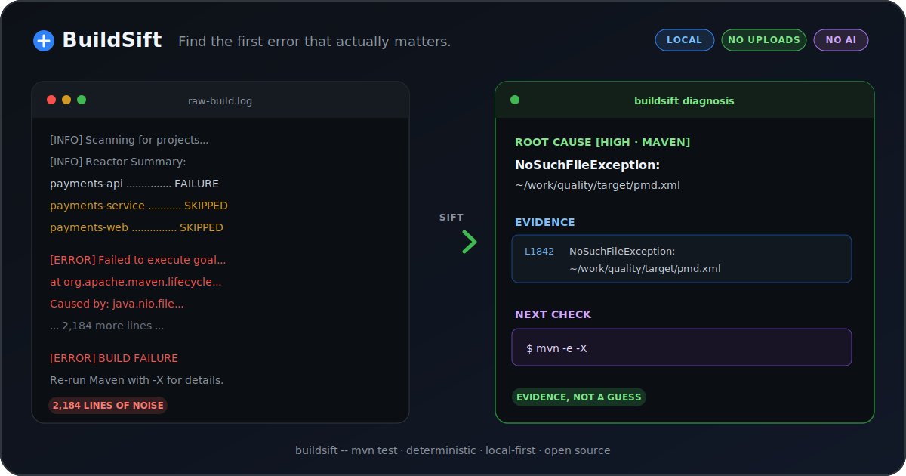

# BuildSift

**Turn failed build logs into compact, line-numbered evidence packets for Claude, Codex, CI—and humans.**

Local. Deterministic. No log uploads. BuildSift keeps the useful failure signal, folds the cascade, and points back to the exact source lines.

[简体中文](README.zh-CN.md)



## Try it in 30 seconds

Install the latest binary from [Releases](https://github.com/topchen2025/buildsift/releases/latest), or install with Go:

```bash
go install github.com/topchen2025/buildsift/cmd/buildsift@latest
```

Analyze a saved log:

```bash
buildsift build.log
```

Or wrap a command and keep its original output and exit status:

```bash
buildsift -- mvn test
```

BuildSift v0.1 focuses on Maven, Gradle, npm/pnpm, and Docker/Compose failures.

## From log noise to an evidence packet

```text
BUILDSIFT DIAGNOSIS
===================
ROOT CAUSE [HIGH · MAVEN]
NoSuchFileException: ~/work/quality/target/pmd.xml

EVIDENCE
  L1842  NoSuchFileException: ~/work/quality/target/pmd.xml

CASCADE
  17 additional failure signal(s) folded

NEXT CHECK
  mvn -e -X
```

The example is illustrative. BuildSift only reports evidence found in the input log; it does not invent an explanation when no supported pattern is present.

The result is small enough to paste into Claude or Codex, structured enough for CI, and explicit enough for a human to verify against the original log.

## Use it with agents and automation

Create a shareable text packet:

```bash
buildsift build.log > evidence.txt
```

Request machine-readable output for scripts and CI:

```bash
buildsift --json build.log
```

Or analyze the failed portion of a GitHub Actions run:

```bash
gh run view --log-failed | buildsift
```

For a repository-native integration, use the [BuildSift GitHub Action](docs/github-action.md) with a pinned version:

```yaml
- name: Analyze failed build log
  uses: topchen2025/buildsift@v0.1.0
  with:
    log-path: build.log
```

## Why deterministic rules?

Build logs are evidence, not a creative-writing prompt.

- **Verifiable:** evidence includes the original line numbers.
- **Repeatable:** the same log and rule set produce the same result.
- **Private by default:** analysis runs locally without uploading the log.
- **Fast to adopt:** no model, API key, account, or service is required.
- **Honest about uncertainty:** unsupported failures are reported as unknown instead of guessed.

BuildSift complements AI tools; it gives them a smaller, grounded input instead of asking them to search an entire noisy log.

## What it does—and does not do

BuildSift ranks concrete failure signals, favors the earliest actionable cause, folds recognized downstream errors, and emits evidence plus a next check. It can read a file, stdin, or the output of a wrapped command.

It is not a general-purpose debugger, and its current rule set cannot recognize every build failure. See the transparent corpus and evaluation method in [docs/benchmark.md](docs/benchmark.md); no universal accuracy or compression claim is implied.

## Privacy and redaction

The analyzer makes no network request and sends no log to a server. Wrapped build commands can still use the network exactly as they normally would.

Diagnostic evidence masks common token, password, URL-credential, and home-directory patterns. Redaction is best-effort, not a guarantee: logs can still contain credentials, private paths, source snippets, or customer data, so inspect output before sharing it. See [SECURITY.md](SECURITY.md).

## Contributing

The highest-value contribution is a sanitized real-world failure log with its confirmed root cause. That turns one incident into a regression fixture for everyone.

See [CONTRIBUTING.md](CONTRIBUTING.md) for the workflow and fixture requirements. Please report vulnerabilities through GitHub Security Advisories instead of a public issue.

## License

[MIT](LICENSE)
